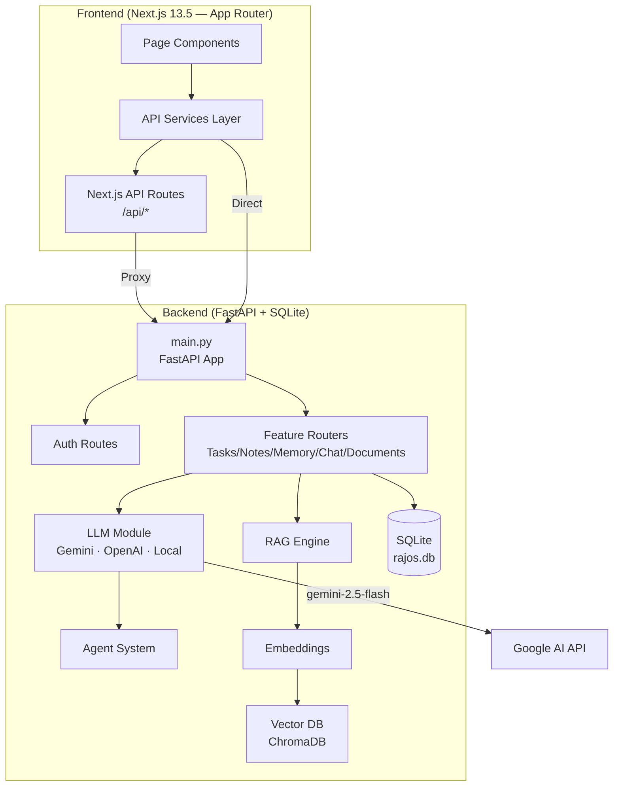
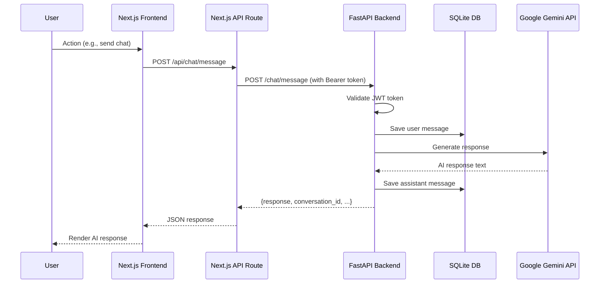
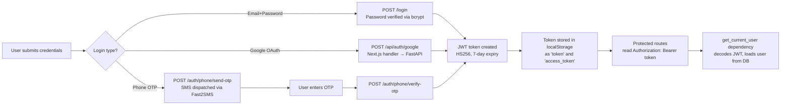

# RajOS V2 Architecture

> **Status:** Phase 1 Foundation Complete — V2 Stabilization in Progress  
> **Last Updated:** September 2026

---

## Table of Contents

1. [System Overview](#1-system-overview)
2. [Technology Stack](#2-technology-stack)
3. [Backend Folder Responsibilities](#3-backend-folder-responsibilities)
4. [Frontend Folder Responsibilities](#4-frontend-folder-responsibilities)
5. [Request Lifecycle](#5-request-lifecycle)
6. [Authentication Lifecycle](#6-authentication-lifecycle)
7. [Database Architecture](#7-database-architecture)
8. [LLM Provider Architecture](#8-llm-provider-architecture)
9. [Conversation Architecture](#9-conversation-architecture)
10. [Memory Architecture](#10-memory-architecture)
11. [Document and RAG Architecture](#11-document-and-rag-architecture)
12. [Tool Registry Architecture](#12-tool-registry-architecture)
13. [Agent Architecture](#13-agent-architecture)
14. [Automation Architecture](#14-automation-architecture)
15. [Frontend-to-Backend Communication](#15-frontend-to-backend-communication)
16. [Completed Features](#16-completed-features)
17. [Partial Features](#17-partial-features)
18. [Missing Features](#18-missing-features)
19. [Technical Debt](#19-technical-debt)
20. [V2 Improvement Roadmap](#20-v2-improvement-roadmap)

---

## 1. System Overview

RajOS is an intelligent personal operating system combining AI chat, memory, tasks, notes, documents, search, agents, and automation into one unified workspace.



---

## 2. Technology Stack

| Layer | Technology | Version |
|-------|-----------|---------|
| Frontend Framework | Next.js (App Router) | 13.5.1 |
| Frontend Language | TypeScript | 5.2.2 |
| UI Components | Radix UI + Tailwind CSS | Latest |
| 3D/Animation | Three.js + Framer Motion | Latest |
| Charts | Recharts | 2.x |
| Backend Framework | FastAPI | 0.140.x |
| Backend Language | Python | 3.10+ |
| ORM | SQLAlchemy | 2.x |
| Database | SQLite (dev) / PostgreSQL (prod) | - |
| Auth | JWT via python-jose + bcrypt | - |
| Primary AI | Google Gemini 2.5 Flash | - |
| Secondary AI | OpenAI GPT-4 (optional) | - |
| Vector DB | ChromaDB | Latest |
| Embeddings | sentence-transformers | Latest |

---

## 3. Backend Folder Responsibilities

```
app/
├── main.py                  # App factory, middleware, router registration
├── core/
│   ├── config.py            # Centralised settings (pydantic-settings, .env)
│   ├── logging.py           # Logging setup
│   └── security.py          # Password hashing utilities
├── database/
│   └── connection.py        # Engine, SessionLocal, get_db() dependency, Base
├── models/                  # SQLAlchemy ORM models (User, Task, Note, ...)
├── schemas/                 # Pydantic request/response schemas
├── routes/                  # Auth, User, Profile routes (uses oauth2 scheme)
├── routers/                 # Feature routers: chat, tasks, notes, memory, ...
├── services/                # Business logic: AI, context, preference, profile
├── security/                # JWT creation, dependencies (get_current_user)
├── llm/                     # LLM abstraction: router, config, providers
│   └── providers/           # GeminiProvider, OpenAIProvider, LocalProvider
├── agents/                  # Agent orchestration
├── memory/                  # MemoryEngine — pattern matching + storage
├── conversation/            # ConversationManager — history tracking
├── automation/              # Automation rules + router
├── documents/               # Document processing + router
├── search/                  # Search router + indexing
├── embeddings/              # Embedding generation router
├── rag/                     # RAG pipeline + router
├── vector_db/               # ChromaDB adapter + router
├── productivity/            # Productivity router (routines, habits)
├── notifications/           # Push notification handling
└── tools/                   # Tool registry
```

**Naming conventions:**
- Routers in `app/routes/` use `OAuth2PasswordBearer` (form-based login).
- Routers in `app/routers/` use `HTTPBearer` token dependency.
- These two systems coexist but should eventually be unified (V2 debt).

---

## 4. Frontend Folder Responsibilities

```
Frontend/
├── app/                     # Next.js App Router pages
│   ├── api/                 # Next.js API Route Handlers (proxy + Gemini)
│   │   ├── auth/            # Google OAuth, phone OTP handlers
│   │   ├── chat/            # Chat message handler (Gemini direct call)
│   │   ├── agents/          # Agent runner handler
│   │   └── tasks/           # Task PATCH handler
│   ├── dashboard/           # Dashboard page
│   ├── chat/                # AI Chat page
│   ├── tasks/               # Tasks page
│   ├── notes/               # Notes page
│   ├── memory/              # Memory page
│   ├── agents/              # Agents page
│   ├── analytics/           # Analytics page
│   ├── knowledge/           # Knowledge/RAG page
│   ├── documents/           # Documents page
│   ├── login/               # Login page
│   └── settings/            # Settings page
├── components/              # Shared UI components
├── services/api/            # API service functions
│   ├── client.ts            # Base URL constant
│   ├── auth.ts              # Login, register, Google, phone OTP
│   ├── chat.ts              # sendMessage, getHistory
│   ├── tasks.ts             # getTasks, createTask, toggleTaskStatus
│   ├── notes.ts             # CRUD
│   ├── memory.ts            # CRUD
│   └── dashboard.ts         # Stats, activity
├── lib/
│   ├── types.ts             # Shared TypeScript interfaces
│   ├── data.ts              # Static nav data, sample data
│   └── utils.ts             # Utility functions
└── hooks/                   # Custom React hooks
```

---

## 5. Request Lifecycle



**Fallback chain (offline resilience):**
1. `Next.js API Route` — forwards to FastAPI with timeout (3.5s)
2. `FastAPI direct` — if Next.js route unavailable
3. `Gemini direct` — from Next.js route handler if FastAPI offline (10s timeout)
4. `Local fallback` — pattern-based canned responses if Gemini unavailable

---

## 6. Authentication Lifecycle



**Security status:**
- ✅ Passwords hashed with bcrypt
- ✅ JWT signed with configurable SECRET_KEY (from .env)
- ✅ Token expiry: 7 days (configurable via ACCESS_TOKEN_EXPIRE_MINUTES)
- ⚠️ No token refresh mechanism (Phase 2 item)
- ⚠️ Offline fallback creates client-side fake tokens (by design for demo resilience — must be removed for production)

---

## 7. Database Architecture

### Current Schema

```
users
  id (PK)  username  email  password(hash)  phone_number  device_id
  notifications_enabled

tasks
  id (PK)  title  description  completed  priority  due_date  completed_at
  user_id (FK → users)

notes
  id (PK)  title  content  user_id (FK → users)

memories
  id (PK)  key  value  user_id (FK → users)

conversations
  id (PK)  title  user_id (FK → users)

messages
  id (PK)  role  content  conversation_id (FK → conversations)

documents
  id (PK)  ... user_id (FK → users)

automations
  id (PK)  ... user_id (FK → users)
```

### Data Safety Rules (enforced in Phase 1)
- All table creation is additive (`create_all` — never drops)
- All queries filter by `user_id` to enforce data isolation
- No raw SQL — SQLAlchemy ORM only
- Two SQLite files exist: `rajos.db` (root) and `backend/rajos.db` — only root is used by the active server

### Missing (V2)
- `created_at` / `updated_at` timestamps on most models
- Database migration system (Alembic) — currently create_all only
- Indexes on foreign keys and frequently queried columns
- Soft deletes instead of hard deletes

---

## 8. LLM Provider Architecture

```
app/llm/
├── llm_config.py      # Legacy config (direct os.getenv — superseded by settings)
├── llm_service.py     # LLMService.generate() — delegates to router
├── llm_router.py      # Maps provider name → provider instance
├── llm_router_api.py  # FastAPI router for LLM configuration endpoints
├── llm_schemas.py     # Pydantic schemas
└── providers/
    ├── base_provider.py   # Abstract BaseLLMProvider
    ├── gemini_provider.py # GeminiProvider — uses google-genai SDK
    ├── openai_provider.py # OpenAIProvider — uses openai SDK
    └── local_provider.py  # LocalProvider — rule-based fallback
```

**Default flow:** `ai_service.py` → `LLMService.generate(provider="gemini")` → `GeminiProvider.generate(prompt)` → Google Gemini API

**Model:** `gemini-2.5-flash` (configurable via `GEMINI_MODEL` env var)

---

## 9. Conversation Architecture

Each user has multiple `Conversation` records. Each conversation has ordered `Message` records (role: `user` | `assistant`).

**Current limitations:**
- Messages only carry `role` and `content` — no timestamps
- History is retrieved as flat list — no pagination
- Context window not managed — full history sent to LLM

---

## 10. Memory Architecture

`MemoryEngine` (in `app/memory/`) uses keyword/regex pattern matching to extract named facts from user messages and stores them as `Memory(key, value)` records per user.

**Current state:** Rule-based pattern matching (not embedding-based). The `app/embeddings/` and `app/vector_db/` modules exist for semantic memory but are not yet wired into the chat flow.

---

## 11. Document and RAG Architecture

`app/documents/` handles document upload and text extraction.
`app/rag/` and `app/vector_db/` implement a RAG pipeline using ChromaDB.
`app/embeddings/` generates sentence-transformer embeddings.

**Current state:** Routers and scaffolding exist. End-to-end RAG integration into the chat response pipeline is partial (not wired into the default chat flow).

---

## 12. Tool Registry Architecture

`app/tools/` contains the tool registry scaffolding. Individual tool implementations are not yet complete. The Agent system in `app/agents/` calls tools via the registry but available tools are limited.

---

## 13. Agent Architecture

Five agents are defined in the frontend UI (Atlas, Nova, Sage, Echo, Pulse). The `app/agents/agent.py` backend implementation exists but provides pattern-matching responses. True agent orchestration with tool use and multi-step planning is a V2 goal.

---

## 14. Automation Architecture

`app/automation/` provides basic automation rules (time-based triggers). The frontend `/automation` page exists. End-to-end automation execution is partial.

---

## 15. Frontend-to-Backend Communication

| Feature | Primary | Fallback 1 | Fallback 2 |
|---------|---------|------------|------------|
| Chat | `POST /api/chat/message` (Next.js) | `POST ${API}/chat/message` (FastAPI) | Gemini direct + local patterns |
| Auth | `POST /login` (FastAPI) | Client-side fake token | — |
| Tasks toggle | `PATCH /api/tasks` (Next.js) | `PATCH ${API}/tasks/{id}/complete` | Silent client-side success |
| Dashboard | `GET ${API}/dashboard/stats` | — | Static sample data |

**Token management:**
- Stored in `localStorage` under both `token` and `access_token` keys
- All FastAPI calls use `Authorization: Bearer {token}` header

---

## 16. Completed Features

- ✅ User registration and login (email/password)
- ✅ Google OAuth login (via Supabase or Next.js handler)
- ✅ Phone OTP login (via Fast2SMS or resilient fallback)
- ✅ JWT authentication with 7-day expiry
- ✅ Task CRUD with completion toggle and priority
- ✅ Notes CRUD
- ✅ Memory CRUD + pattern-based extraction
- ✅ Chat with Gemini AI (with multi-agent persona switching)
- ✅ Chat conversation history
- ✅ Dashboard stats + activity
- ✅ Multimodal file uploads in chat (images + documents)
- ✅ Professional frontend (sidebar, 3D components, glassmorphism)
- ✅ Health check endpoint
- ✅ Docker + docker-compose configuration
- ✅ Centralised configuration (pydantic-settings)

---

## 17. Partial Features

- ⚠️ RAG pipeline — modules exist, not wired into chat
- ⚠️ Document processing — upload works, RAG retrieval incomplete
- ⚠️ Agent system — persona routing works, tool use incomplete
- ⚠️ Automation — basic rules exist, execution partial
- ⚠️ Semantic search — embedding generation exists, search not fully connected
- ⚠️ Profile/preference system — extraction and storage exist, LLM context injection incomplete

---

## 18. Missing Features

- ❌ Token refresh mechanism (re-login required every 7 days)
- ❌ Database migrations (Alembic)
- ❌ `created_at`/`updated_at` model timestamps
- ❌ Soft deletes
- ❌ Rate limiting
- ❌ Admin endpoints
- ❌ WebSocket for real-time chat
- ❌ Multi-tenancy isolation beyond user_id filter
- ❌ Production-grade secret rotation
- ❌ Frontend token expiry detection + redirect to login

---

## 19. Technical Debt

| Priority | Issue | Location |
|----------|-------|----------|
| 🔴 Critical | Offline fallback creates fake JWT tokens | `services/api/auth.ts` |
| 🔴 Critical | TypeScript build errors silenced in next.config.js | `Frontend/next.config.js` |
| 🟡 High | Two `get_current_user` implementations coexist | `app/routes/auth.py` vs `app/security/dependencies.py` |
| 🟡 High | `backend/` subdirectory mirrors root `app/` — confusing | Repo structure |
| 🟡 High | No database migrations — `create_all` only | DB architecture |
| 🟡 High | Message model has no `created_at` timestamp | `app/models/message.py` |
| 🟡 Medium | `LLMConfig` duplicates `core/config.py` settings loading | `app/llm/llm_config.py` |
| 🟡 Medium | Chat history has no pagination | `app/routers/chat.py` |
| 🟠 Low | `auth.py` in `app/routes/` uses OAuth2PasswordBearer (different scheme) | Inconsistency |
| 🟠 Low | CORS origins check on Supabase URL in auth service | `services/api/auth.ts` line 57 |

---

## 20. V2 Improvement Roadmap

### Phase 1 (Current) — Foundation & Stability
- [x] Centralised configuration
- [x] Hardcoded secrets removed
- [x] Consistent `get_db()` dependency
- [x] Corrected Gemini model name
- [x] CORS from environment variable
- [x] `.env.example` documented
- [x] Testing foundation
- [x] Health + readiness endpoints
- [x] Architecture documentation

### Phase 2 — Production Hardening
- [ ] Alembic database migrations
- [ ] Token refresh endpoint
- [ ] Frontend token expiry detection
- [ ] Rate limiting (slowapi)
- [ ] Structured JSON logging
- [ ] Sentry or similar error tracking
- [ ] Remove client-side fake JWT fallback

### Phase 3 — AI Feature Completion
- [ ] Wire RAG pipeline into chat response
- [ ] Semantic memory retrieval (embedding-based)
- [ ] Full agent tool use implementation
- [ ] Streaming responses (SSE / WebSocket)
- [ ] Multi-LLM routing with cost optimization

### Phase 4 — Scale & Polish
- [ ] PostgreSQL migration for production
- [ ] WebSocket real-time chat
- [ ] Mobile-responsive PWA
- [ ] Admin dashboard
- [ ] Usage analytics
