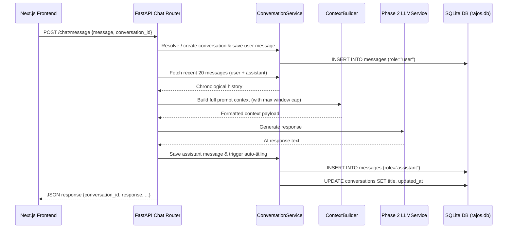

# RajOS V2 — Phase 3 Conversation Intelligence 2.0 Specification

> **Status:** Phase 3 Complete — Verified 30/30 Test Cases Passing  
> **Last Updated:** September 2026

---

## 1. Executive Summary

Phase 3 transforms the RajOS conversation workspace into a persistent, intelligent, multi-turn conversation platform. It decouples business logic from HTTP handlers, guarantees deterministic message persistence, limits context window limits, auto-generates titles via the Phase 2 `LLMService`, enforces user data isolation across all endpoints, and provides extension hooks for future Memory, RAG Knowledge, and Tool execution modules.

---

## 2. Conversation Architecture

---

## 3. Data Models & Schema

### `Conversation` Table (`conversations`)
- `id` (INT, PK, Index)
- `user_id` (INT, FK → `users.id`)
- `title` (VARCHAR)
- `user_title` (BOOL, default `False`) — Prevents auto-titling from overwriting manual user renames
- `archived` (BOOL, default `False`)
- `created_at` (DATETIME, default `utcnow`)
- `updated_at` (DATETIME, default `utcnow`, onupdate `utcnow`)

### `Message` Table (`messages`)
- `id` (INT, PK, Index)
- `conversation_id` (INT, FK → `conversations.id`)
- `role` (VARCHAR: `user` | `assistant` | `system`)
- `content` (TEXT)
- `created_at` (DATETIME, default `utcnow`)

---

## 4. RESTful API Reference

| Method | Endpoint | Description | Auth Required |
|--------|----------|-------------|---------------|
| `POST` | `/chat/message` | Send message, build context, return AI reply | Yes |
| `GET` | `/chat/conversations` | List user's conversations (paginated, ordered by activity) | Yes |
| `GET` | `/chat/conversations/{id}` | Fetch conversation detail + ordered messages | Yes |
| `PATCH` | `/chat/conversations/{id}` | Manually rename conversation title | Yes |
| `PATCH` | `/chat/conversations/{id}/archive` | Archive or restore conversation | Yes |
| `DELETE` | `/chat/conversations/{id}` | Delete single conversation and its messages | Yes |
| `GET` | `/chat/search?q={query}` | Search conversations by title or message content | Yes |
| `GET` | `/chat/history` | Backward-compatibility legacy endpoint | Yes |
| `DELETE` | `/chat/history` | Backward-compatibility clear history endpoint | Yes |

---

## 5. Security & User Data Isolation

All conversation queries strictly filter by `Conversation.user_id == user.id`. Attempts by User B to access, modify, or delete User A's conversation return `404 Not Found`, preventing parameter tampering or data leaks across users.

---

## 6. Context Window & Future Extension Points

`ContextBuilder` formats up to 20 recent messages in chronological order with roles (`User: ...`, `Assistant: ...`). It contains structured extension points for future phases:
- `semantic_memory`: Extension point for Phase 4 Memory 2.0
- `rag_documents`: Extension point for Phase 5 RAG Knowledge Base
- `tool_context`: Extension point for Phase 6 Tool Execution & Agents
