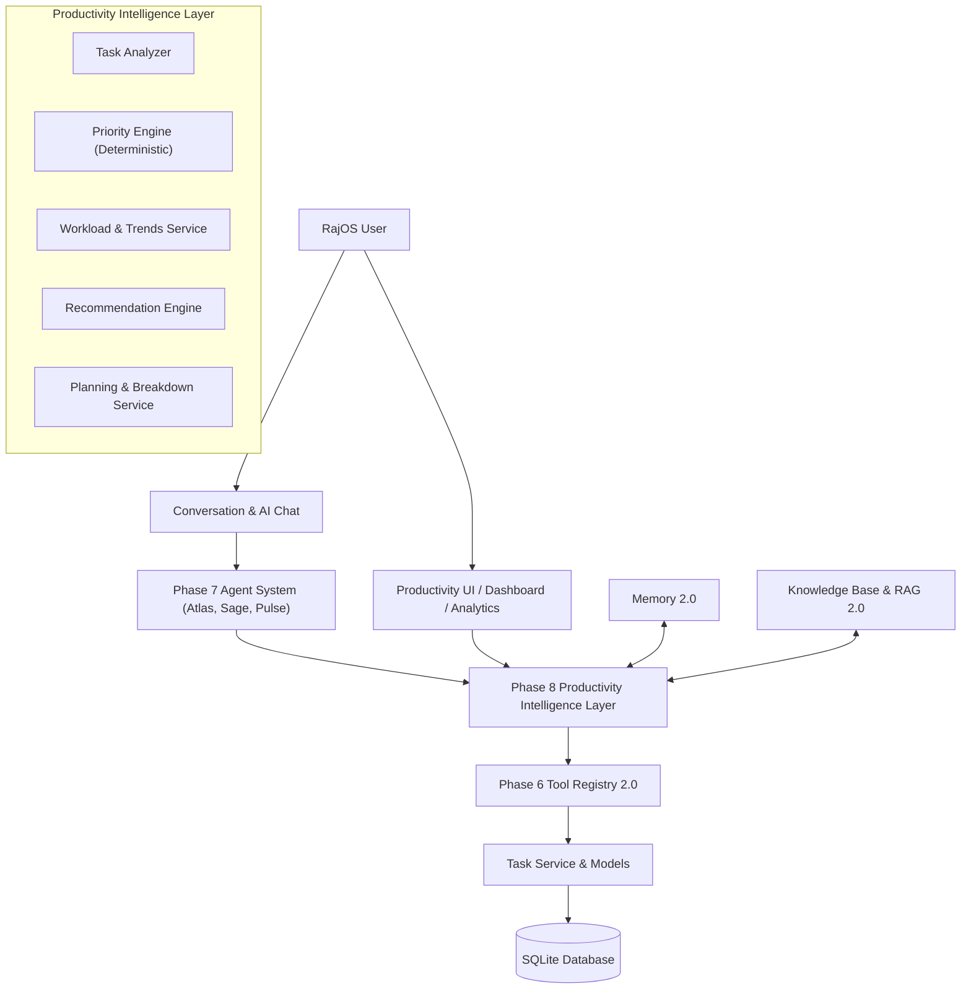

# RajOS V2 — Phase 8: Productivity Intelligence Architecture & Specifications

## 1. Overview & Primary Objective

RajOS V2 Phase 8 introduces the **Productivity Intelligence Layer**, transforming RajOS from a passive task storage system into an intelligent assistant capable of understanding work context, evaluating priorities deterministically, producing daily briefs, generating explainable recommendations, planning schedules, and executing actionable tasks through registered tools.

---

## 2. Conceptual Architecture



---

## 3. Priority Scoring Formula & Explainability

The **Priority Engine** (`app/productivity/priority_engine.py`) calculates deterministic priority scores ($0 - 100$) without overwriting user-defined priorities:

$$\text{Priority Score} = \text{Base} + \text{Urgency} + \text{Dependency} + \text{Age} + \text{Effort}$$

Where:
- **User Priority Base**: `high` $= 40$, `normal` $= 20$, `low` $= 10$.
- **Urgency**: Overdue $= +50$, Due Today $= +35$, Due $\le 3$ Days $= +20$, Due $\le 7$ Days $= +10$.
- **Dependency Impact**: $+10$ per subtask (max $+30$).
- **Age Score**: $+2$ per pending day (max $+15$).
- **Effort Bonus/Penalty**: Quick win ($\le 30$m) $= +10$, Heavy ($\ge 120$m) $= -5$.

### Priority Categories
- $80 - 100$: `urgent`
- $55 - 79$: `high`
- $30 - 54$: `normal`
- $0 - 29$: `low`

Every priority recommendation returns an array of human-readable rationale strings (e.g. `["Marked high priority by user (+40)", "Overdue by 2 day(s) (+50)"]`).

---

## 4. Smart Task Analysis & Workload Service

The `TaskAnalyzer` (`app/productivity/task_analyzer.py`) categorizes tasks per user into:
- **Overdue**: $due\_date < now$ and $completed = False$.
- **Due Soon**: $due\_date \le now + 3\text{ days}$ and $completed = False$.
- **Stale**: Pending $\ge 7$ days without update.
- **Quick Wins**: Estimated duration $\le 30$ minutes.
- **Heavy Tasks**: Estimated duration $\ge 120$ minutes.
- **High Impact**: Priority score $\ge 60$ or blocking subtasks.
- **Unscheduled**: High priority without deadline.

---

## 5. Structured Recommendations Schema

Recommendations generated by `RecommendationEngine` (`app/productivity/recommendation_engine.py`) are strictly non-destructive:

```json
{
  "id": "uuid-v4-string",
  "type": "overdue_task | deadline_risk | quick_win | missing_deadline | task_breakdown | planning",
  "title": "Resolve overdue task: 'Deploy RAG Cluster'",
  "description": "Task was due on 2026-09-24 and remains incomplete.",
  "reason": "Overdue task with priority score 90. Overdue work creates backlog pressure.",
  "related_task_ids": [14],
  "action_suggestion": "Complete task or reschedule due date",
  "priority": "urgent"
}
```

---

## 6. Registered Productivity Tools (Tool Registry 2.0)

Phase 8 registers 10 tools in the Tool Registry (`app/tools/productivity_tools.py`):

1. `get_productivity_summary`: Full task analysis and counts.
2. `get_daily_brief`: Daily brief with focus recommendations and quick wins.
3. `get_weekly_summary`: 7-day completion rates and top categories.
4. `get_overdue_tasks`: Detailed list of overdue tasks.
5. `get_due_soon_tasks`: Tasks due within 3 days.
6. `get_task_recommendations`: Explainable actionable recommendations.
7. `plan_tasks`: Daily time-allocated schedule recommendations.
8. `break_down_task`: Proposed subtasks for complex goals.
9. `get_workload`: Workload metrics and priority distribution.
10. `get_productivity_trends`: 7-day completion trends (returns `has_sufficient_data: False` if sparse).

---

## 7. Security & User Data Isolation

Every endpoint and service method requires an authenticated `User` context (`get_current_user` / `context.user_id`). Database queries explicitly filter by `Task.user_id == user_id`, guaranteeing total multi-tenant isolation.

---

## 8. REST API Endpoints

- `GET /productivity/summary` — Full task categorization summary.
- `GET /productivity/daily` — Daily brief & focus tasks.
- `GET /productivity/weekly` — Weekly completion report.
- `GET /productivity/recommendations` — Explainable recommendations.
- `GET /productivity/workload` — Category & priority distribution.
- `GET /productivity/trends` — 7-day completion velocity.
- `POST /productivity/plan` — Time-boxed daily schedule generation.
- `POST /productivity/breakdown` — Subtask breakdown suggestions.

---

## 9. Verification & Readiness for Phase 9

- **Backend Pytest Suite**: All 65+ unit tests passing (100%).
- **Frontend Typecheck**: Next.js TypeScript typecheck passing with 0 errors.
- **Phase 9 Automation Extension Points**: Daily brief and deadline risk recommendations emit extension payloads ready for Phase 9 trigger automation.
